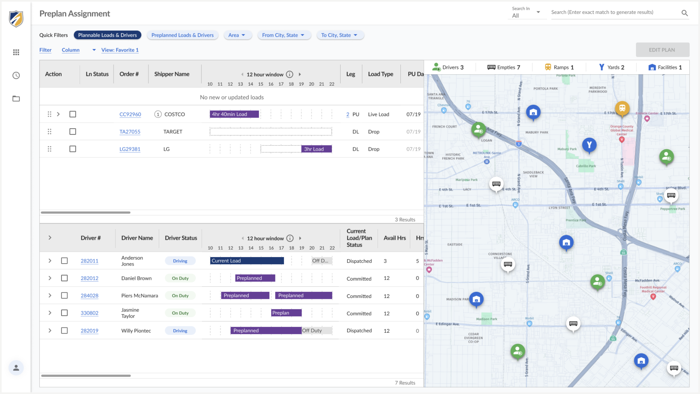
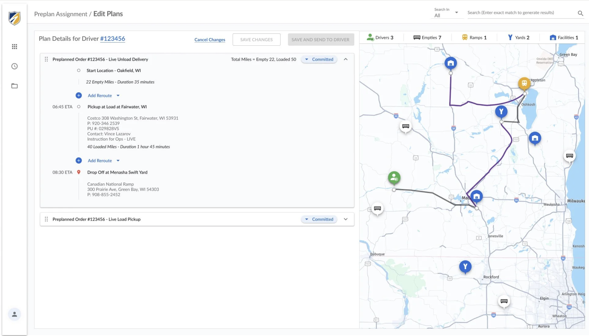

CONTEXT

## The problem
*Understanding the challenge and its business impact*

At Swift, customer service reps had no reliable way to track a load's status. They had to check three or more separate systems, and often learned about delays only when a customer called, costing hours of avoidable rework each week. Research also surfaced a separate revenue risk: missing proof-of-delivery uploads.

RESEARCH

## The approach
*Research, synthesis, and design system foundation*

Working under a fixed deadline with one designer for most of the project, I partnered with the UX researcher who led it to interview 21 users across five departments, synthesized through affinity mapping into a journey map. We also visited a Swift operations site to observe workflows directly. As the deadline approached, I shifted to building a shared design system so the team could move from validated workflows straight into production-ready mockups.

## My contribution
*My specific role and responsibilities in the project*

- Conducted research and synthesis alongside the UX researcher: conducted interviews, built the journey map, and identified the core problem and a separate revenue-risk finding
- Made the scoping call to flag the revenue-risk finding rather than expand the project
- Built the project's design system from the ground up
- Designed the interactive timeline, turning it from a display into a tool
- Designed the planning dashboard's workflow end-to-end
- Maintained design consistency across the team after a second designer joined mid-project

## Key decisions
*Critical choices that shaped the project direction*

| | |
|---|---|
| **01. Scoping** | Identified a revenue-risk finding (proof-of-delivery uploads) outside the project scope and flagged it separately to keep the team focused. |
| **02. Buy vs. build** | Used Vue Material as the foundation, then built custom components (drag-and-drop planning, live map) to hit the deadline. |
| **03. Timeline as a tool** | Extended the status timeline to let users mark status, message, and receive alerts—closing the communication gap. |

IDEATION
## Prioritizing features strategically

Drag and drop interaction for planning exploration

SOLUTION

## An experience that connects workflows

- **Consolidated order details dashboard**: order information, a live map, and an interactive timeline in one view

- **Planning dashboard**: designed the planning workflow end-to-end, including the drag-and-drop scheduling interaction

<h3 style="margin-top: 3rem;">Order Details Redesign</h3>

**Before:** Legacy system (green-on-black terminal interface)

**After:** Modern interface (clean UI with map, forms, and data)

<h3 style="margin-top: 3rem;">Planning Redesign</h3>

**Designed interface** (modern planning dashboard with drag-and-drop scheduling)

OUTCOME

## Results achieved and impact measured

The redesign resolved most identified pain points: 80% for customer service, 45% for planners, 36% for driver managers, with reduced workflow complexity in order entry, plan assignment, search, and planning. The project was paused before launch due to company-wide cuts. In usability testing, users and the product owner responded positively to the timeline, alerts, and drag-and-drop planning, all seen as faster and clearer than the legacy workflow.

REFLECTION

## Key learnings and what I'd do differently

I'd scope this differently: focus early on the highest-revenue-risk problem instead of redesigning the full workflow at once. Doing everything in parallel created real overhead and, at times, overwhelmed the PO and stakeholders. A leaner, phased approach would have reduced that strain and gotten something in front of users sooner.
